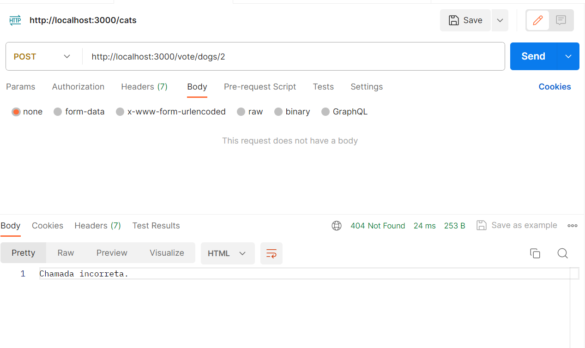
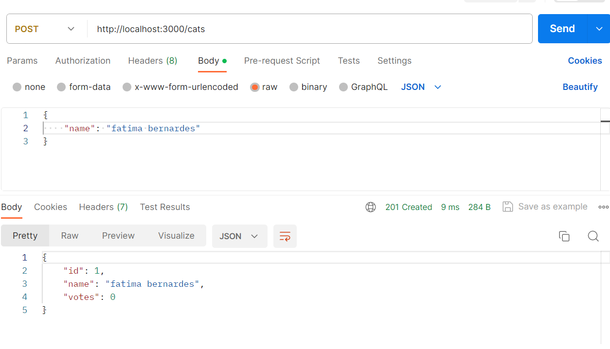
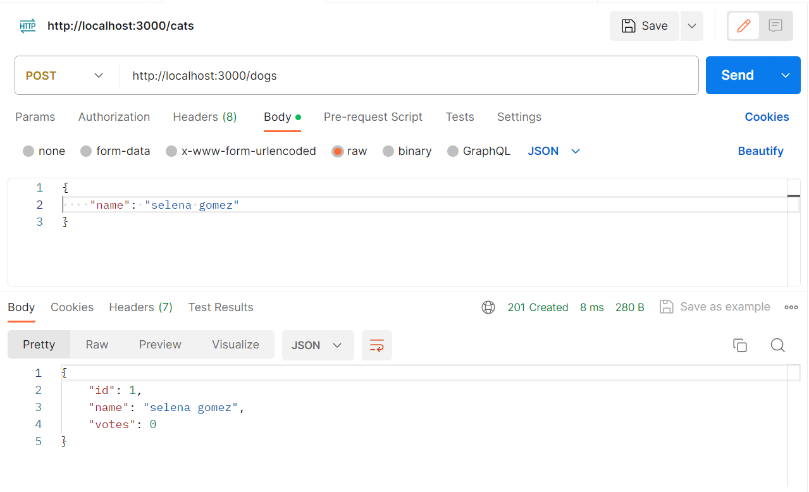
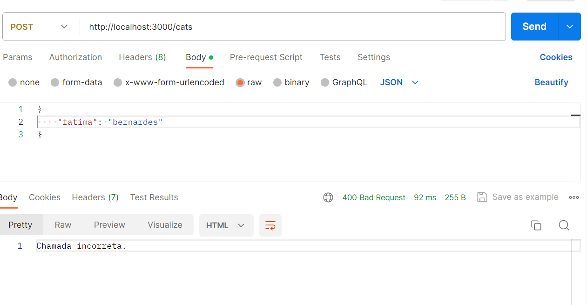
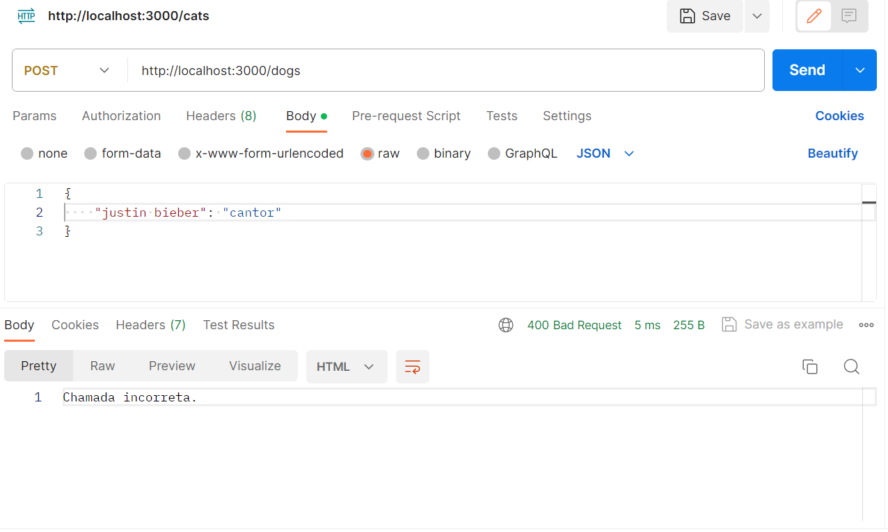
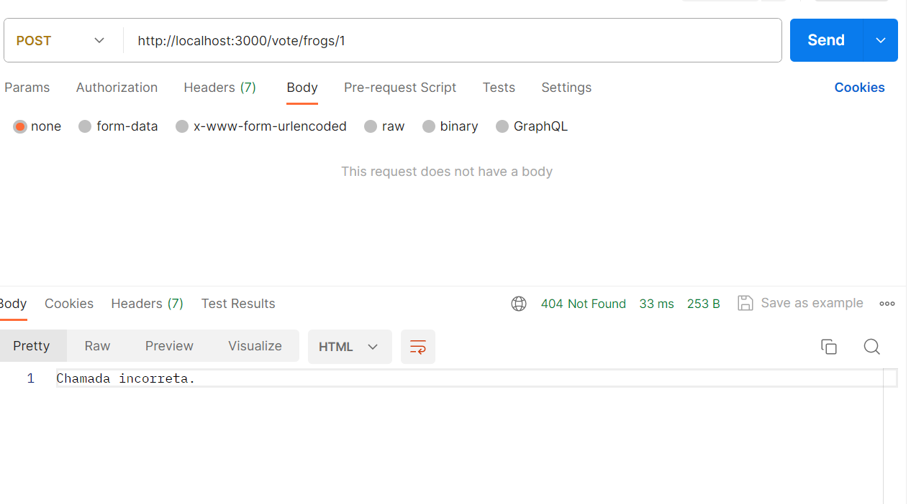

# PROVA 2 DO GABS

## Sanitizar e validar dados de entrada para evitar SQL Injection.

O que tava rolando? A chamada API que o professor forneceu estava inserindo diretamente o nome da string SQL sem qualquer verificação! Isso torna o código vulnerável a ataques de injeção de SQL. 

O que fiz para resolver? Utilizando o placeholder (?) eu passo o valor do nome como um parâmetro no array, o que impede que o db leia uma possível injeção de SQL como SQL.

Ja na parte do animaltype o que fiz foi fazer uma verificação. Agora o sistema só aceita estar escrito em animaltype as palavras 'cats' ou 'dogs'!

## Corrigir a lógica de votação para que verifique se o registro do animal existe antes de adicionar um voto.

O que tava rolando? Não havia nenhum tipo de verificação na parte de votos! Além disso o ID estava sempre vindo como undefined na hora de fazer os gets.

O que fiz para resolver? Mudei as tabelas para id ser INTEGER PRIMARY KEY AUTOINCREMENT. Além disso, agora ele faz a verificação no banco se o id realmente existe. Caso não, o usuário toma um erro.

## Implementar e tratar erros de maneira adequada, sem vazar detalhes de implementação.

Os erros foram tratados como ditos anteriormente. Para evitar vazar detalhes de implementação, deixei os logs de erro os mais simples possíveis.
Sendo eles: Chamada incorreta ou Erro interno da aplicação.

## Implementar todos os métodos que possuem assinatura no código
Métodos que estavam vazios agora estão implementados!

### Prints de algumas chamadas!
Chamadas bem sucedidas

Chamadas mal sucedidas

